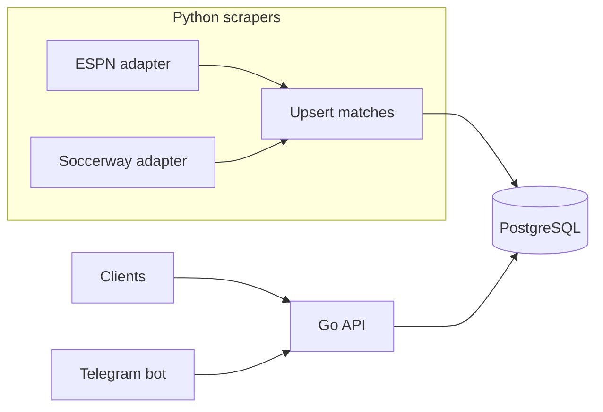

# Football Fan API

This repository contains a small system for **scheduled Brazilian football fixtures**: national leagues (e.g. Brasileirão), continental and domestic cups (e.g. Libertadores, Sul-Americana, Copa do Brasil), with room to extend to **estaduais** and other competitions. A **Python** service scrapes public sources and writes to **PostgreSQL**; a **Go** HTTP API reads from the same database for clients and integrations. An optional **Go** Telegram bot (`bots/telegram/`) calls that API to register subscribers and send scheduled notifications.

## Requirements

- **Go** 1.24+ (for local API development; matches `api/go.mod` and the API Docker image)
- **Python** 3.11+ and **[uv](https://docs.astral.sh/uv/)** (for local scraper development and lockfile management)
- **PostgreSQL** 14+ (16 used in Docker)
- **Docker** and **Docker Compose** (recommended for running everything together)
- **[just](https://github.com/casey/just)** (optional; repo root `Justfile` wraps Compose for start/stop/logs)

## Architecture



- **PostgreSQL** is the single source of truth: `competitions`, **`teams`** (one row per club, globally unique `name`), **`team_competitions`** (many-to-many with optional `season` and exactly one `is_primary` row per team), and **`matches`**, all in schema **`footballfan`** (not `public`).
- **Scrappers** (`scrappers/`) fetch fixtures, normalize them, and **upsert** rows keyed by `(source, external_match_id)` so re-runs do not duplicate matches.
- **API** (`api/`) exposes REST endpoints (team/match reads plus subscriber routes for integrations); it does not scrape. SQL migrations run **on API startup** (embedded in the binary).

Data flow: scrapers populate `matches` on a schedule; the API serves `GET /teams`, `GET /teams/{teamId}`, and `GET /teams/{teamId}/matches` for date-bounded queries.

## Design choices

| Area | Choice |
|------|--------|
| API runtime | Go standard library `net/http`, Go 1.22 `ServeMux` with path patterns |
| Database access | `pgx/v5` connection pool |
| Migrations | Embedded SQL under `api/internal/migrate/sql/`, applied in lexical order into schema `footballfan`; versions recorded in `footballfan.schema_migrations` |
| Scrapers | `httpx`, BeautifulSoup/lxml, `psycopg` for upserts, APScheduler; dependencies managed with **uv** (`pyproject.toml` + `uv.lock`) |
| Competitions (MVP) | SQL seed is **competition catalog only**; **clubs** are created by scrapers (`teams` + `team_competitions`) from ESPN/Soccerway fixtures — no hardcoded team list in migrations |
| Team ↔ competition | `team_competitions(team_id, competition_id, season, is_primary)`; Série A/B links **take priority** as `is_primary` when scraped; `GET /teams` picks primary row, or any linked competition if none |

## Repository layout

| Path | Role |
|------|------|
| `api/` | Go HTTP server, migrations, Dockerfile |
| `bots/telegram/` | Optional Telegram bot (Go), Dockerfile |
| `scrappers/` | Python package `football_scrapers`, `uv.lock`, Dockerfile |
| `docker-compose.yaml` | Postgres + pgAdmin + API + scraper + optional `telegram` |
| `Justfile` | Shortcuts for local Docker Compose (`just up`, `just logs`, …) |
| `.env.example` | Template for optional Compose/runtime variables (copy to `.env`; never commit secrets) |

## Local PostgreSQL setup

Use this when the API or scrapers run on your machine and Postgres is installed locally (or reachable on the LAN).

1. **Create a role and database** (adjust names/passwords to your policy). With `psql` as a superuser:

   ```bash
   psql -U postgres -c "CREATE USER football WITH PASSWORD 'football';"
   psql -U postgres -c "CREATE DATABASE football OWNER football;"
   ```

   Alternatively, if your OS user is already a Postgres superuser:

   ```bash
   createdb football
   ```

   Then set `DATABASE_URL` to match your user and no password, for example `postgres://YOUR_USER@localhost:5432/football?sslmode=disable`.

2. **Verify connectivity:**

   ```bash
   psql "$DATABASE_URL" -c "SELECT 1"
   ```

3. **Configure the app:** copy the example env files and point them at this database (see [.env.example](.env.example), [api/.env.example](api/.env.example), [scrappers/.env.example](scrappers/.env.example)).

4. **Apply migrations** by starting the API once (`go run ./cmd/server` from `api/` with `DATABASE_URL` set). That creates schema `footballfan`, tables `competitions`, `teams`, `team_competitions`, and `matches`, plus seed data.

5. **Run the scrapers** after migrations exist; they populate `teams`, `team_competitions`, and `matches`. From `scrappers/`, use `uv sync` then `uv run python -m football_scrapers` (see [scrappers/README.md](scrappers/README.md)). Until a scrape succeeds, `GET /teams` may be empty.

Inside Docker Compose, services talk to the `postgres` hostname, not `localhost`. The compose file sets `DATABASE_URL` for containers; use `.env` at the repo root only for optional overrides such as `SCRAPER_INTERVAL_HOURS` or `LOG_LEVEL` (see [.env.example](.env.example)).

## How to run the whole project (Docker)

From the repository root. Prefer **[just](https://github.com/casey/just)** recipes (see [Justfile](Justfile)); they run `docker compose -f docker-compose.yaml` for you.

### `just` commands

Run `just` or `just --list` to see all recipes. Common ones:

| Command | Description |
|---------|-------------|
| `just up` | Start all services **detached** (`docker compose up -d`). Extra args pass through (e.g. `just up --build`). |
| `just down` | Stop and remove containers; **keeps** Postgres/pgAdmin volumes. |
| `just down-volumes` | Like `down` but **removes volumes** (wipes the database — use only when you want a clean slate). |
| `just build` | Build images without starting. |
| `just rebuild` | `docker compose build --no-cache` then `up -d`. |
| `just start` / `just stop` | Start or stop existing containers without removing them. |
| `just restart-services` | `docker compose restart` — optional service names, e.g. `just restart-services api`. |
| `just restart` | **Destructive dev reset:** drops schema `footballfan` (all app data + migration history in that schema), rebuilds **api** and **scraper** images with `--no-cache`, then recreates those containers so migrations run again. Requires a running Postgres (starts the stack first). |
| `just logs` | Follow logs (optionally: `just logs api scraper`). |
| `just logs-tail` | Last 200 log lines, no follow. |
| `just ps` | `docker compose ps -a`. |
| `just db-shell` | `psql` inside the `postgres` container (`football` / `football`). Query app tables with the `footballfan` schema prefix (e.g. `footballfan.matches`). |
| `just shell` | Shell in a container (default `api`), e.g. `just shell scraper`. |

### What Compose starts

- **postgres** — database `football`, user/password `football` (see [docker-compose.yaml](docker-compose.yaml)), port `5432` on the host
- **pgadmin** — web UI for Postgres at `http://localhost:5050` (default login `admin@example.com` / `admin`; override with `PGADMIN_DEFAULT_EMAIL`, `PGADMIN_DEFAULT_PASSWORD`, `PGADMIN_PORT` in `.env`). In pgAdmin, register a server with host **`postgres`**, port **5432**, username **`football`**, password **`football`**, database **`football`**.
- **api** — HTTP on `http://localhost:8080`
- **scraper** — runs one scrape on startup, then on the configured interval (default 24 hours)

Wait until Postgres is healthy; the API applies migrations on first start.

### Without `just`

Equivalent examples from the repo root:

```bash
docker compose up --build          # foreground; Ctrl+C stops containers
docker compose up -d --build       # detached (same idea as `just up --build`)
```

Try the API:

```bash
curl -s http://localhost:8080/healthz
curl -s http://localhost:8080/teams
```

Optional: copy [.env.example](.env.example) to `.env` in the repo root to set `SCRAPER_INTERVAL_HOURS`, `SCRAPER_CRON`, or `LOG_LEVEL` for the scraper service (Compose substitutes these into [docker-compose.yaml](docker-compose.yaml)). For API and scraper env when running on the host, see [api/.env.example](api/.env.example) and [scrappers/.env.example](scrappers/.env.example).

## Continuous integration

[GitHub Actions](.github/workflows/ci.yml) runs on pushes and pull requests to `main` / `master`: Go tests (`api/`), Python tests (`scrappers/`), and Docker builds for the API and scraper images.

## Documentation

- [api/README.md](api/README.md) — environment variables, endpoints, and API behavior
- [scrappers/README.md](scrappers/README.md) — running scrapers, sources, scheduling, and matching rules

## Ethical scraping

Scrapers should respect site terms of use, use a identifiable `User-Agent` (configurable), throttle requests, and avoid hammering endpoints. This project is intended for personal or research use; production use may require official data licenses.
